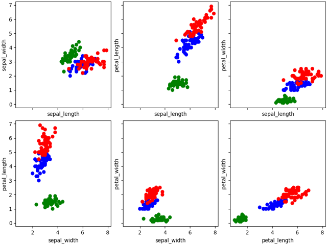
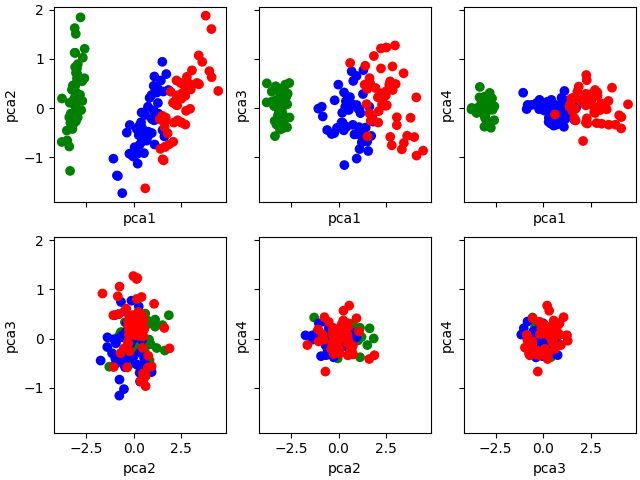

# Rustats
An assortment of statistical methods written in Rust. This project is split into

## Project structure

## Cli
### Build
Prerequisite: Rust is setup, https://www.rust-lang.org/tools/install

In the cli director `cargo build --release`
## Agg
This finds the min, max, mean and standard deviation of a given field in a dataset.

### Testing
Testing details can be found in [experiments/agg](experiments/agg/README.md)

## PCA
Principle Component Analysis is a preprocessing step to produce a hierarchical basis
ordered by amount of variance. This can allow you to remove basis with little or
negative impact on the effectiveness of say clustering algorithms being run.

Here we can see that pca1 against pca2 makes the differences in species more distinct.
pca3 and pca4 don't help to distinguish the groups and can likely be removed. Tests can
be done to find the ideal number of principal components to keep but I need to revise this.

| Iris Dataset | Iris dataset after PCA |
| - | - |
|  |  |

Typically this is done by first calculating the Single Value Decomposition (SVD)
which is faster but I haven't looked into methods for calculating the SVD yet.
Instead I've used a more direct translation of the maths of PCA.

### Implementation
Take the input data, $X$. We first center the data.
$$B=X-\bar{X}$$
Find the covariance.
$$C=B^TB$$
Next we need to find the eigenvectors of $C$. To do this we first find the eigenvalues which can be approximated with QR decomposition.

#### QR Algorithm
For the matrix $C$ we find $C=QR$ such that $Q$ is an orthogonal matrix and $R$ is an upper triangular matrix. We can approximate the matrix $D$ where the diagonal of $D$ is the eigenvalues of $C$ in order of magnitude with the following:
$$Q_1R_1=C$$
$$D_1=R_1Q_1$$
$$Q_2R_2=D_1$$
$$D_2=R_2Q_2$$
$$\vdots$$
$$D_k=R_kQ_k$$
In my experience so far $D_k$ approaches $D$ quite quickly. Around 10 iterations has been plenty for my use case. I haven't
looked into this rigorously yet.
#### Power Method
Now that we have the eigenvalues we can approximate the eigenvectors. The power method is that if we keep applying $C$ to a vector $u$ we'll approach the most prominent eigenvector in $C$. Using 2 additional facts:

1) The least prominent eigenvector of $C$ is the most prominent eigenvector of $C^{-1}$
2) For an eigenvalue $\lambda$ it's associated eigenvector $v$ is the least prominent eigenvector of $C-\lambda I$

With this we have
$$(C-\lambda I)^kv_k=u$$
Then solve for $v_k$ using the $LU$ decomposition of $(C-\lambda I)^k$.

#### QR Decomposition
#### LU Decomposition
