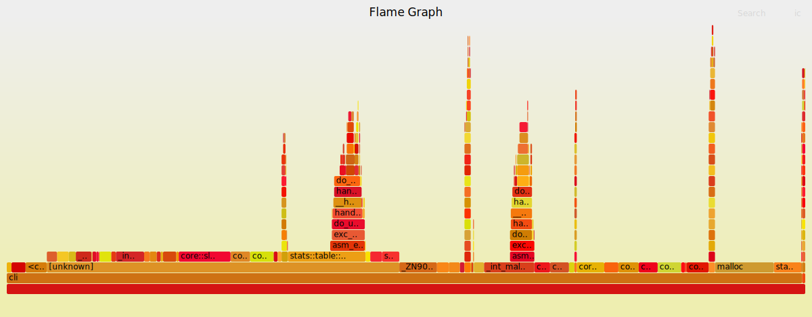

# Agg testing
## Hardware
The following are ran on an AMD Ryzen 5 3600 6-Core processor with 32GB of ram and
a 1TB PCS 2.5" SSD.
## Many rows, few columns
### Dataset
In the following example `../1brc/1b.csv` is 1 billion lines of weather station data
produced from the [1 billion row challenge](https://github.com/gunnarmorling/1brc).
This data set has two columns - measurement and station - separated by a semicolon.
### Test grouped
The total time taken to process 1 billion rows is around 10s
```
$ cargo build --release
$ time ./target/release/cli agg measurement ../1brc/1b.csv -c ";" -g station > /dev/null
real    0m10.351s
user    0m9.255s
sys     0m1.094s
```

Looking at a [FlameGraph](https://github.com/brendangregg/FlameGraph) we can see only
3.44% of time was spent in `group_num_agg`, and 9.73% was in `from_csv`.
```
$ sudo perf record -F 99 -g ./target/release/cli agg measurement ../1brc/1b.csv -c ";" -g station
$ sudo perf script | ../FlameGraph/stackcollapse-perf.pl > out.perf-folded
$ cat out.perf-folded | ../FlameGraph/flamegraph.pl > perf-kernel.svg
```

A lot of the time being spent is related to allocating memory. There's some time in exc_page_fault
which also points to memory issues, this could be from an attempt to access a memory address that had been moved to swap. It makes sense that we would have memory issues since this implementation is
parsing all 1 billions rows one by one into Vecs before processing the data.

Starting the Vecs with a capacity of 1,000,000,000 upfront doesn't make a noticeable difference
to the performance and reading the file to a string before processing reduces the time
by around a second (although 1 second difference could be due to unrelated factors).
Next things to figure out for this method are:
- How long are we waiting on memory?
- Where are most of the memory calls coming from?
- How long are we waiting on io?

More details like memory usage and number of swaps can be found with `/usr/bin/time -v`
so I made the script time_tests.py to automate running this and can now output a
csv with the stats for 100 runs with just `./experiments/time_tests.py -n 100 agg measurement ../1brc/1m.csv -c "';'" -g station > experiments/agg/1mrc_100_runs.csv`. Next I'll make
plots of the data.
